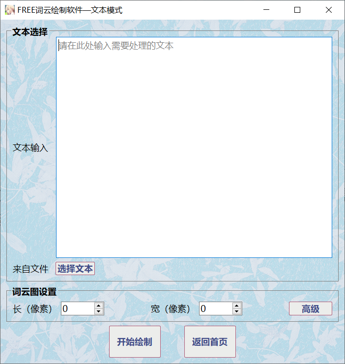
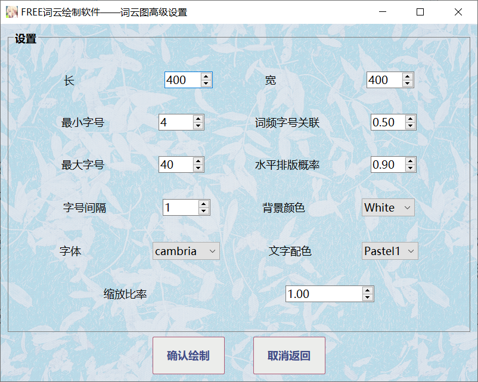

# WordCloud

WordCloud 是一款使用 Python 开发的基于客户端的词云生成系统，其在传统词云生成软件的基础上增加了用户自行设置词语权重的功能，同时支持对生成词云图的高度自定义。

## 一、开发环境及工具

Windows10

- Python 3.10
- Pycharm 2023.2
- 图片查看器

## 二、部署教程

- 安装 Python3.10 及以上版本
- 使用 `pip install requirements.txt`语句安装所需依赖模块
- 运行 main.py 程序

## 三、使用说明

成功运行程序后，将会进入主页，如下图：

文本模式为传统的根据给定文本生成词云，权重模式则是支持使用者自定义所有需要显示的词语及其对应权重，用户可以根据自己的实际需要选择合适的模式。

### 1.文本模式

在文本模式中，支持用户从文本框输入或是选择一个txt文件进行文本上传。请注意，文本内容是词云图的绘制的必要条件，如果不进行文本内容的指定会造成生成失败。

在指定文本之后可以进行词云图长款的设置，本软件中用户最大可以生成1920$\times$1080大小的词云图。如果不设置则默认生成400$\times$400的图片。一般来说词云图越大所需要生成的时间也越多，请用户根据实际情况进行选择。

如果用户想更进一步地对词云图进行自定义，可以通过点击高级按钮进入词云图高级设置界面，如下图：

除了自定义词云图长宽外，本软件还支持对最小字号、最大字号、字号间隔、字体、文字配色、背景颜色、水平排版概率、词频字号关联以及缩放比率进行自定义。

- 最小字号：指词云图中文字字号的最小值，默认为4
- 最大字号：指词云图中文字字号的最小值，默认为40
- 字号间隔：指从最小字号到最大字号的步进变化间隔，默认为1
- 字体：词云图文字字体，本软件支持从系统目录中搜索所有可用的字体文件，用户可以使用下拉框自行选择
- 词频字号关联：