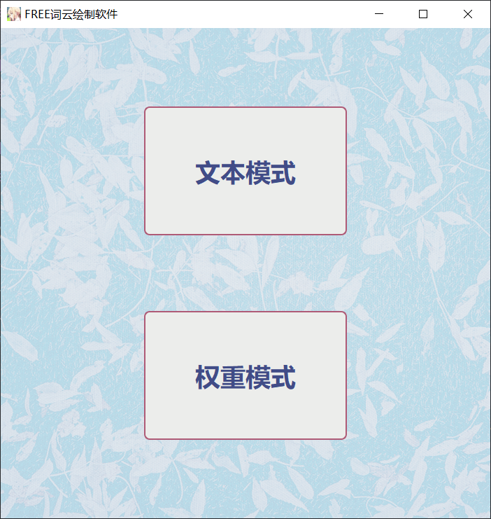

# WordCloud

WordCloud 是一款使用 Python 开发的基于客户端的词云生成系统，其在传统词云生成软件的基础上增加了用户自行设置词语权重的功能，同时支持对生成词云图的高度自定义。

## 开发环境及工具

Windows10

- Python 3.10
- Pycharm 2023.2
- 图片查看器

## 部署教程

- 安装 Python3.10 及以上版本
- 使用 `pip install requirements.txt`语句安装所需依赖模块
- 运行 main.py 程序

## 使用说明

成功运行程序后，将会进入主页，如下图：

文本模式为传统的根据给定文本生成词云，权重模式则是支持使用者自定义所有需要显示的词语及其对应权重，用户可以根据自己的实际需要选择合适的模式。