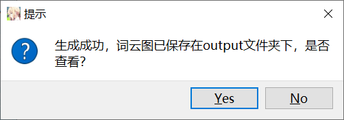
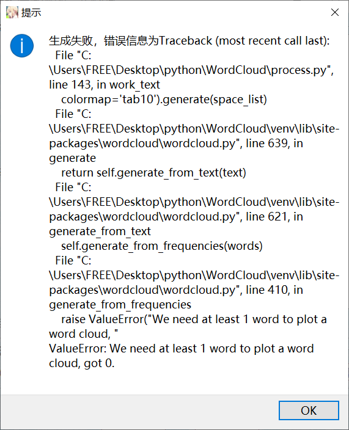
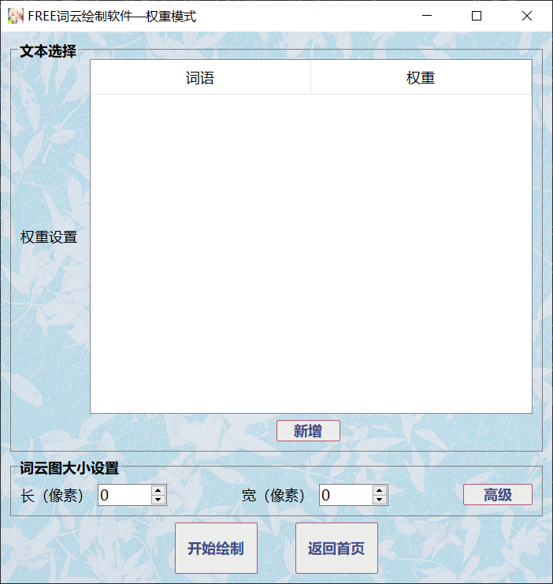
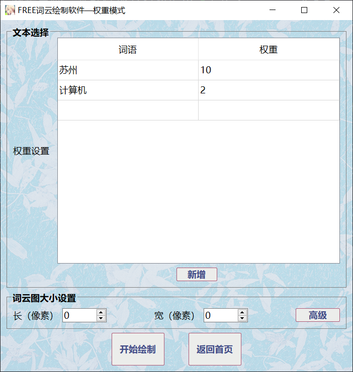

# WordCloud

WordCloud 是一款使用 Python 开发的基于客户端的词云生成系统，其在传统词云生成软件的基础上增加了用户自行设置词语权重的功能，同时支持对生成词云图的高度自定义。

## 一、开发环境及工具

Windows10

- Python 3.10
- Pycharm 2023.2
- 图片查看器

## 二、部署教程

- 安装 Python3.10 及以上版本。
- 使用 `pip install requirements.txt`语句安装所需依赖模块。
- 运行 main.py 程序。

## 三、使用说明

成功运行程序后，将会进入主页，如下图：


文本模式为传统的根据给定文本生成词云，权重模式则是支持使用者自定义所有需要显示的词语及其对应权重，用户可以根据自己的实际需要选择合适的模式。

### 1.文本模式


在文本模式中，支持用户从文本框输入或是选择一个txt文件进行文本上传。请注意，文本内容是词云图的绘制的必要条件，如果不进行文本内容的指定会造成生成失败。

在指定文本之后可以进行词云图长款的设置，本软件中用户最大可以生成1920 $\times$ 1080大小的词云图。如果不设置则默认生成400 $\times$ 400的图片。一般来说词云图越大所需要生成的时间也越多，请用户根据实际情况进行选择。

如果用户想更进一步地对词云图进行自定义，可以通过点击高级按钮进入词云图高级设置界面，如下图：


除了自定义词云图长宽外，本软件还支持对最小字号、最大字号、字号间隔、字体、文字配色、背景颜色、水平排版概率、词频字号关联以及缩放比率进行自定义。

- 最小字号：指词云图中文字字号的最小值，默认为4。
- 最大字号：指词云图中文字字号的最小值，默认为40。
- 字号间隔：指从最小字号到最大字号的步进变化间隔，默认为1。
- 字体：词云图文字字体，本软件支持从系统字体目录中搜索所有可用的字体文件，用户可以使用下拉框自行选择。
- 词频字号关联：字号收到词频大小的关联比率，默认为0.5。
- 水平排版概率：指词云图中文字水平方向出现的概率，默认为0.9，表示大部分文字都是横向排布。
- 背景颜色：指词云图背景颜色，可以从[White, Black, Blue, Yellow, Red, Green, Pink, Grey]中任选其一，默认为White。
- 文字配色：指文字的配色组合，可以从[Pastel1, Pastel2, Paired, Accent, Dark2, Set1, Set2, Set3, tab10, tab20, tab20b, tab20c]中自行选择。
- 缩放比率：指词云图大小的缩放比例，默认为1，即不进行缩放。当使用者需要大尺寸词云图且对生成时间比较敏感时，可以在保持词云图长宽不变的前提下增加缩放比率。

在进行完词云图操作之后用户可以点击开始绘制按钮进行词云图的绘制，如果生成成功将会以`当前时间.png`为文件名保存在output文件夹下，同时弹出如下提示框，点击Yes按钮便可以使用系统默认的图片查看软件一键打开：



生成的词云图样例：


如果生成失败则会弹出如下包含错误信息的提示框：



用户可以根据提示信息进行生成操作的调整。

### 2.权重模式



权重模式与文本模式类似，只不过文本选择的形式变为了用户自定义所需词语及其对应的权重，如下图：



用户可以点击新增按钮增加需要的{词语：权重}组合。

权重模式下的词云图设置与文本模式相同，具体操作用户可以参照文本模式中的介绍。

## 软件结构

WordCloud
│  .gitignore
│  main.py
│  process.py
│  README.md
│  requirements.txt
│          
├─output
│      .gitigonre
│      
├─README
│      image-20230216161813980.png
│      image-20230216162540764.png
│      image-20230216163433829.png
│      image-20230216170959513.png
│      image-20230216171302219.png
│      image-20230216171356730.png
│      image-20230216171517631.png
│      
├─resources
│      Advanced.qss
│      Advanced.ui
│      AdvancedNew.qss
│      AdvancedNew.ui
│      background.png
│      dict.txt
│      logo.ico
│      logo.jpg
│      Main.qss
│      Main.ui
│      stop_words.txt
│      Text.qss
│      Text.ui
│      Weight.qss
│      Weight.ui
|—————————————————
        

其中 main.py为主程序，绘制了软件主要的的四个界面，process.py 实现了文本分词以及词云图绘制部分的代码，requirements.txt文件列出了软件运行所依赖的模块，README.md文件（即本文件）介绍了软件的大致情况。

output文件夹存放所生成好的词云图，resources文件夹存放软件所需要的各种资源文件，包括软件图标、软件背景图、界面样式设计文件，词频字典以及常见停顿词字典。README文件夹存放本文使用的图片。

其中process.py的分词核心算法展示如下：

```python
# 以下为全局变量，分别为字典形式的前缀词trie树、没实际意义而要去除的停顿词、总词汇频数及其对数
predict = {}
stopwords = []
tot = 0
logtot = 0

# 求前缀trie树
def GetDict():
	# 声明是全局变量
	global predict
	global tot
	global logtot
	with open("resources/dict.txt", 'r', encoding='utf-8') as f:
		content = f.read()
	f.close()
	# 读入resources/dict.txt中的文本信息，即常用词及其频数
	alist = content.split('\n')
	for item in alist:
		# word为词语本身，freq为其频数
		word, freq = item.split()[:2]
		freq = int(freq)
		tot += freq
		predict[word] = freq
		st = ""
		# 将每个词语的所有前缀都存入trie
		for ch in word:
			st += ch
			if st not in predict:
				predict[st] = 0
	# 求总频数的对数
	logtot = log(tot)

# 获取无意义的停顿词
def GetStopWords():
	global stopwords
	with open('resources/stop_words.txt', 'r', encoding='utf-8') as f:
		stopwords = f.read().split()
	f.close()

# 分词算法的主要部分
def work(sentence):
	DAG = {}
	n = len(sentence)
	tar = list(range(n))
	ans = []

	# 构建当前句子的有向无环图
	def GetDAG():
		for pos in range(n):
			teplist = []
			tepst = sentence[pos]
			R = pos
			while tepst in predict:
				if predict[tepst] > 0:
					teplist.append(R)
				R += 1
				if R >= n:
					break
				tepst += sentence[R]
			if len(teplist) == 0:
				teplist.append(pos)
			# 在DAG[pos]里存放pos位置开始的所有结束位置
			DAG[pos] = teplist
		return DAG

	# 使用动态规划求最大概率路径
	def DP():
		# 初始每个位置dp值为0
		dp = [0] * (n + 1)
		global logtot
		dp[n] = 0
		# 从后往前进行状态转移
		for i in range(n - 1, -1, -1):
			flag = 0
			for x in DAG[i]:
				# 如果当前转移的概率大于dp[i]就转移，寻找最大值
				if flag == 0 or log(predict[sentence[i:x + 1]] or 1) - logtot + dp[x + 1] > dp[i]:
					dp[i] = log(predict[sentence[i:x + 1]] or 1) - logtot + dp[x + 1]
					# tar存放从哪里转移来的
					tar[i] = x
					flag = 1

	# 根据tar数组记录的位置进行词的划分，返回一个list
	def CutSentence():
		pos = 0
		while pos < n:
			if sentence[pos:tar[pos] + 1] not in stopwords:
				ans.append(sentence[pos:tar[pos] + 1])
			pos = tar[pos] + 1

	GetDAG()
	DP()
	CutSentence()
	return ans

def cut(st):
	GetDict()
	GetStopWords()
	# 在一次使用中，前缀trie树和停顿词可以提前预处理以减少时空开支
	# 分词前使用正则表达式对文本进行清洗和划分
	r = "[_.!+-=——,$%^，。？?、~@#￥%……&*《》<>「」{}【】()/A-Za-z]"
	st = re.sub(r, ' ', st)
	alist = st.split()
	ans = []
	for item in alist:
		try:
			ans.extend(work(item))
		except:
			print(item)
	return ans
```

